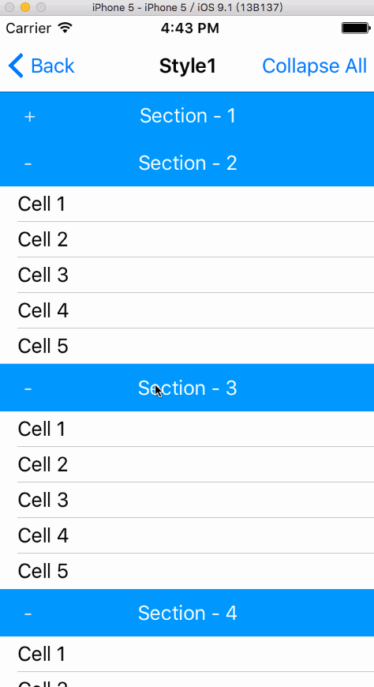

# MGCollapsableTableViewController
Collapsable UITableView Sections.

* Xcode 7 or higher.
* iOS 6.0 or higher.

## Screenshot

## Sample Project
Download the whole project or clone this Git repository.

## Usage
* The `./Base` folder, which contains all required source files, should be copied to your project.
* Implement your own section header view with `MGCollapsableTableViewSectionViewBase` protocol.
    * Implement the `delegate` property.
    * Invoke `delegate`'s `- (void)collapseableSection:(id)sectionView isCollapsed:(BOOL)isCollapsed` on header view events, e.g. when user taps on header view.
    * Implement the `tableViewSectionCollapsed` property, note that its getter and setter are used to obtain or change the state of the header view, **you should not invoke `delegate` methods when `tableViewSectionCollapsed` changes**.
* Implement your own `UITableViewController` by subclassing `MGCollapsableTableViewController`.
    * Create an array of `MGCollapsableTableViewSectionSource` objects as the data source for UITableView.
    * Implement `- (CGFloat)tableView:(UITableView *)tableView heightForHeaderInSection:(NSInteger)section` and return your desired header view height.
    * Implement `- (UIView *)tableView:(UITableView *)tableView viewForHeaderInSection:(NSInteger)section`. You **must call `[self setupCollapsableSection:sectionIndex:]` on each section view object** in order to delegate header view events to `UITableViewController`.
    * Implement other necessary methods(`cellForRowAtIndexPath`...).
    * Call `collapseSection`, `expandSection`, `collapseAllSections`, `expandAllSections` if you want programmatically control the state of a(all) section(s).
